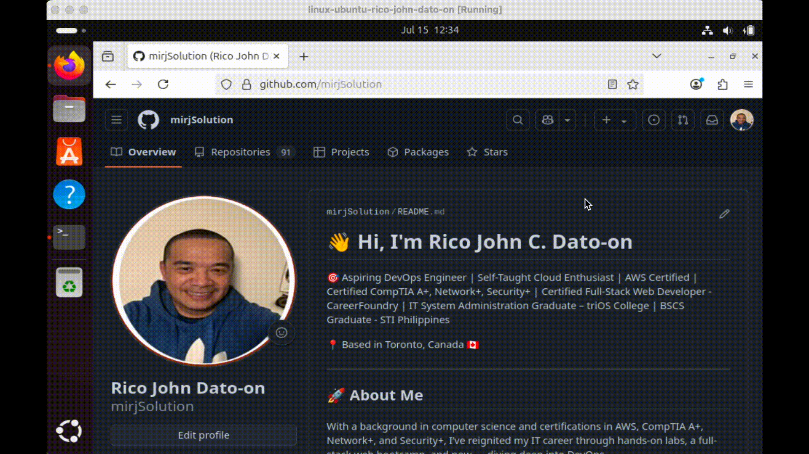
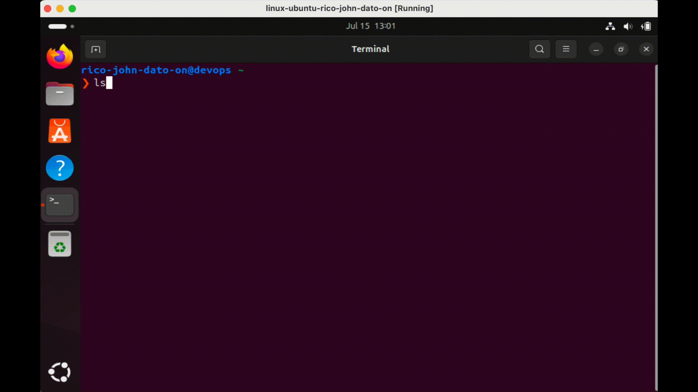

# Git & GitHub Fundamentals for DevOps

Version control is the backbone of modern software development and DevOps. This module introduces you to **Git**, the most widely used version control tool today, and how to integrate it with GitHub or GitLab for effective collaboration, automation, and CI/CD workflows.

## 📌 What is Git?

Git is a distributed version control system that helps developers track changes in source code. It allows multiple developers to work on the same codebase simultaneously without conflicts.

### 🧱 Git Architecture Components

- **Remote Repository**: Where code is stored (e.g., GitHub, GitLab, Bitbucket).
- **Local Repository**: Developer’s local copy of the project with full history.
- **Staging Area**: Intermediate space where changes are reviewed before commit.
- **Working Directory**: Current project folder you are editing.
- **Git Client**: CLI or GUI tool used to interact with Git.

---

## 🚀 Hosting Platforms

- **GitHub** / **GitLab**: Popular cloud-based platforms to host repositories.
- **Private Git Servers**: Used by companies for internal code storage.

Projects can be **public** (open source) or **private** (internal or proprietary). These platforms offer features like user access control, file editing, issue tracking, CI/CD, and more.

### Creating a remote repository in GitHub


## 🛠️ Setting Up Git Locally

1. Customize your terminal using .zshrc` for better Git prompt visibility.


```bash
sudo apt install zsh
touch ~/.zshrc
vim ~/.zshrc
```

Setup configuration .zshrc

```bash
# --- Custom Zsh Prompt Configuration ---

# Function to parse Git branch (keeping your existing, functional one)
parse_git_branch() {
  git branch 2> /dev/null | sed -n -e 's/^\* \(.*\)/[\1]/p'
}

# New Color Definitions
COLOR_USER_HOST='%F{033}'       # Bright Blue for user@host
COLOR_DIRECTORY='%F{048}'      # Vibrant Green for the current directory
COLOR_GIT_BRANCH='%F{220}'     # Golden Yellow for the Git branch
COLOR_PROMPT_ARROW='%F{202}' # Bright Orange for the prompt symbol (❯)
COLOR_RESET='%f'                 # Resets color to default

# Optional: Make specific parts bold
BOLD_START='%B' # Start bold
BOLD_END='%b'   # End bold

# Define the newline character for multi-line prompt
NEWLINE=$'\n'

# Enable PROMPT_SUBST for command substitution and variable expansion in the prompt
setopt PROMPT_SUBST

# Define the new creative prompt, now with input on the next line
export PROMPT='${COLOR_USER_HOST}${BOLD_START}%n@%m${BOLD_END}${COLOR_RESET} ${COLOR_DIRECTORY}%c${COLOR_RESET} ${COLOR_GIT_BRANCH}${BOLD_START}$(parse_git_branch)${BOLD_END}${COLOR_RESET}${NEWLINE}${COLOR_PROMPT_ARROW}❯ ${COLOR_RESET}'

# --- End Custom Zsh Prompt Configuration ---
```

Exit and save vim then run on the terminal

```bash
chsh -s $(which zsh) $(whoami)
```

After that close the terminal and restart you virtual machine.

2. Install Git client virtual machine.


```bash
sudo apt update
sudo apt install git -y
git --version
```

3. Add your public ssh to connect to your remote git repo:

---

## 🔐 Authenticating with SSH

To connect Git CLI to GitHub/GitLab without entering credentials every time:


1. On your terminal

```bash
ls .ssh
cat .ssh/id_rsa.pub
```

2. Copy your public ssh
3. Then go to your GitHub Settings > SSH and GPG Keys > Paste your public SSH > Then save

---

## 📦 Creating and Cloning Repositories

### On GitHub/GitLab:



Go to your repository > find the repo that you want to clone > In Quick setup copy the git hub repo

Like the sample below

```bash
git clone <your GitHub repo>
```

### Locally:

Check if its locally cloned to your machine



```bash
ls
cd <your local repo>
pwd
ls -a
ls .git/
```

You should see and now you successfully clone the repo inside your local machinerepo

---

## 🧠 What We Have Learned

- Git architecture: local, remote, staging
- GitHub/GitLab account creation & project setup
- Connecting Git CLI via SSH
- Creating & cloning repositories

---

## 📘 Why This Matters in DevOps

- Git is central to **CI/CD pipelines**, **collaborative development**, and **infrastructure as code**.
- Every DevOps engineer must be fluent in Git commands and GitHub/GitLab workflows.

> "Mastering Git is mastering the history and future of our code."

🧑‍💻 _Created by Rico John Dato-on_
🔗 [LinkedIn](https://www.linkedin.com/in/rico-john-dato-on) • [Portfolio](https://ricodatoon.netlify.app)

---
