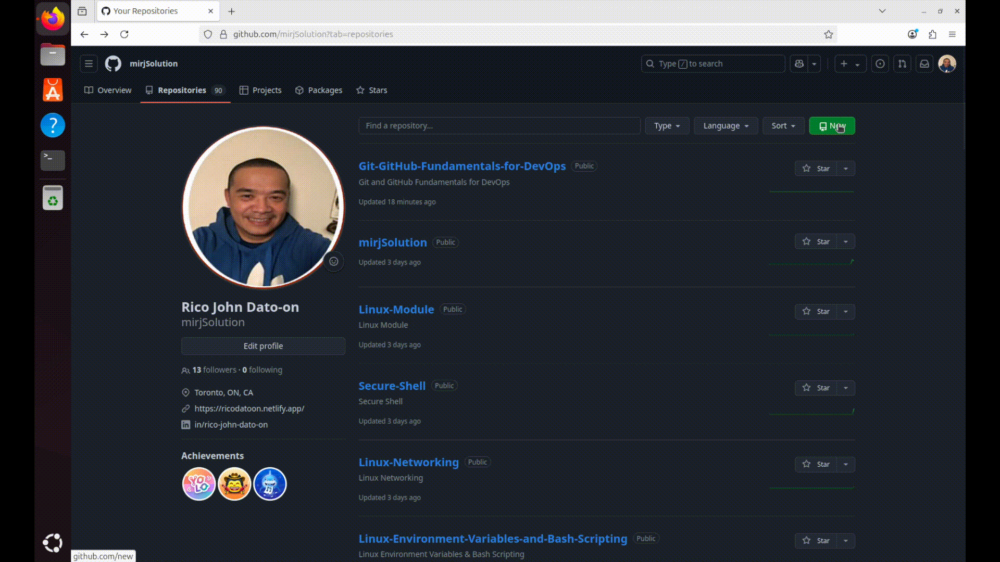
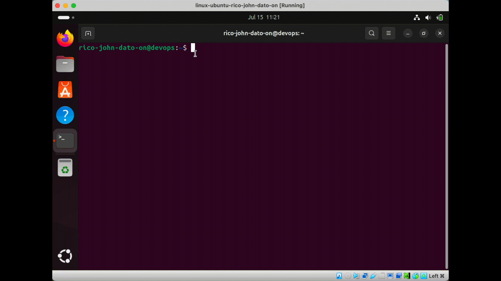

# Git & GitHub Fundamentals for DevOps

Version control is the backbone of modern software development and DevOps. This module introduces you to **Git**, the most widely used version control tool today, and how to integrate it with GitHub or GitLab for effective collaboration, automation, and CI/CD workflows.

## 📌 What is Git?

Git is a distributed version control system that helps developers track changes in source code. It allows multiple developers to work on the same codebase simultaneously without conflicts.

### 🧱 Git Architecture Components

- **Remote Repository**: Where code is stored (e.g., GitHub, GitLab, Bitbucket).
- **Local Repository**: Developer’s local copy of the project with full history.
- **Staging Area**: Intermediate space where changes are reviewed before commit.
- **Working Directory**: Current project folder you are editing.
- **Git Client**: CLI or GUI tool used to interact with Git.

---

## 🚀 Hosting Platforms

- **GitHub** / **GitLab**: Popular cloud-based platforms to host repositories.
- **Private Git Servers**: Used by companies for internal code storage.

Projects can be **public** (open source) or **private** (internal or proprietary). These platforms offer features like user access control, file editing, issue tracking, CI/CD, and more.

### Creating a remote repository in GitHub



## 🛠️ Setting Up Git Locally

1. Customize your terminal using .zshrc` for better Git prompt visibility.



```bash
sudo apt install zsh
touch ~/.zshrc
vim ~/.zshrc
```

Setup configuration .zshrc

```bash
parse_git_branch() {
      git branch 2> /dev/null | sed -n -e 's/^\* \(.*\)/[\1]/p'
}
COLOR_DEF='%f'
COLOR_USR='%F{243}'
COLOR_DIR='%F{197}'
COLOR_GIT='%F{39}'
NEWLINE=$'\n'
setopt PROMPT_SUBST
export PROMPT='${COLOR_USR}%n@%M ${COLOR_GIT}$(parse_git_branch)${COLOR_DEF}${NEWLINE}%% '
```

Exit and save vim then run on the terminal

```bash
chsh -s $(which zsh) $(whoami)
```

After that close the terminal and restart you virtual machine.

2. Install Git client virtual machine.


```bash
sudo apt update
sudo apt install git -y
git --version
```

3. Configure Git user details:

   ```bash
   git config --global user.name "Your Name"
   git config --global user.email "you@example.com"
   ```

---

## 🔐 Authenticating with SSH

To connect Git CLI to GitHub/GitLab without entering credentials every time:

1. Generate an SSH Key:
   ```bash
   ssh-keygen -t rsa -b 4096 -C "you@example.com"
   ```
2. Add the public key to GitHub/GitLab under SSH Settings.
3. You’re now ready to securely `clone`, `pull`, and `push`.

---

## 📦 Creating and Cloning Repositories

### On GitHub/GitLab:

- Create a new repository (select visibility: public/private)
- Copy the SSH URL

### Locally:

```bash
git clone git@github.com:your-username/your-repo.git
cd your-repo
```

---

## 🔄 Basic Git Workflow

```bash
# Check status
git status

# Stage changes
git add .

# Commit changes
git commit -m "Your message"

# Push to remote
git push origin main

# Pull latest changes
git pull origin main
```

---

## 🧠 What You’ve Learned

- Git architecture: local, remote, staging
- GitHub/GitLab account creation & project setup
- Connecting Git CLI via SSH
- Creating & cloning repositories
- Daily Git commands

---

## 📘 Why This Matters in DevOps

- Git is central to **CI/CD pipelines**, **collaborative development**, and **infrastructure as code**.
- Every DevOps engineer must be fluent in Git commands and GitHub/GitLab workflows.

> "Mastering Git is mastering the history and future of your code."

---

🔗 Follow my DevOps journey on GitHub: [mirjSolution](https://github.com/mirjSolution)
